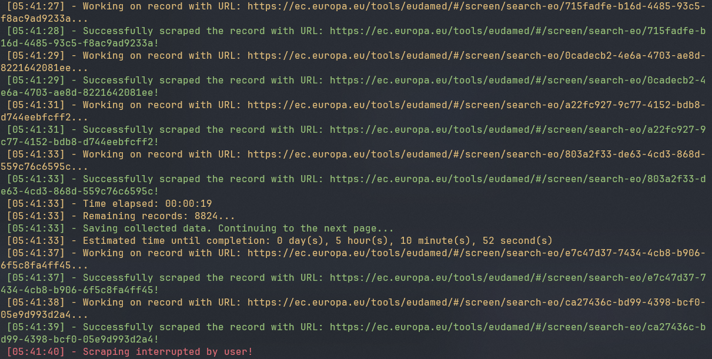

# EUDAMED economic operators scraper

## Introduction:

This Python script is designed as a web scraper to extract data
from [European commission tool called EUDAMED - European Database on Medical Devices
](https://ec.europa.eu/tools/eudamed/#/screen/search-eo) containing information about <u>MANUFACTURERS</u> and <u>
IMPORTERS</u> only. It utilizes Selenium WebDriver to navigate through web pages and extract desired data.
It saves Actor information meaning - Actor identification, Actor address and Actor contact details.
It does not save Competent Authority information.

## Preview


## Tools:

* Language: Python
* Libraries: Selenium WebDriver

## Requirements

* Python 3.12 (tested only on this version, probably works on previous ones too)
* Google Chrome browser (or any other browser supported by Selenium WebDriver, see section - Customization for more
  information)

## Run Locally

1. Clone the project


2. Go to the project directory:

```bash
  cd eudamed-economic-operators-scraper/
```

3. Install virtual environment:

```bash
  python -m venv /venv
```

4. Activate virtual environment:<br>

- Windows CMD:

```bash
  .\venv\Scripts\activate.bat
```

- Windows Powershell:

```bash
  .\venv\Scripts\Activate.ps1
```

- Linux:

```bash
  source /venv/bin/activate
```

5. Install dependencies:

```bash
  pip install -r requirements.txt
```

6. Run the program:

```bash
  python main.py
```

## Customization

There are a bunch of default settings that you can change depending on your likes.

### Default options for ScraperOptions

|           Option           | Default  |                                                                                                                              Comment                                                                                                                               |
|:--------------------------:|:--------:|:------------------------------------------------------------------------------------------------------------------------------------------------------------------------------------------------------------------------------------------------------------------:|
|            ROLE            | importer |                                                                                         If you want to scrap data for manufacturers, change this option to 'manufacturer'                                                                                          |
|       ROWS_PER_PAGE        |    10    |                                                                               You can change this option to allow more or less table rows per page. Choices allowed are: 10, 25, 50                                                                                |
|       PAGE_LOAD_TIME       |    2     |                                               Seconds that it takes your page to load. This will be different for every user since it depends on user's connection speed also on the current health of the website.                                                |
| MAX_CONSECUTIVE_EXCEPTIONS |    5     |                                                                                            If the app runs into unexpected error, it will try to run the script again.                                                                                             |
|   WAIT_TIME_BETWEEN_RUNS   |    30    |                                             Wait time between runs when the app runs into an error.                                       If the app runs into unexpected error, it will try to run the script again.                                              |

### Default options for WebDriverOptions

|       Option        |                                                  Default                                                  |                                                                                                                                          Comment                                                                                                                                           |
|:-------------------:|:---------------------------------------------------------------------------------------------------------:|:------------------------------------------------------------------------------------------------------------------------------------------------------------------------------------------------------------------------------------------------------------------------------------------:|
|  WEBDRIVER_OPTIONS  |  '--headless', '--disable-extensions', '--disable-infobars', '--disable-gpu', '--disable-notifications'   | Bunch of options that will improve performance. You can add more if you want, see the comment under the option to see additional options. Right now it will run the app into headless mode which means it will not show the browser ui, if you want to see the browser remove this option. |
| WEBDRIVER_WAIT_TIME |                                                    10                                                     |                                                                             How much time the webdriver is allowed to wait untill it raises timeout exception. If you have slower connection adjust as needed.                                                                             |

### Additional info

Right now it uses **Chrome** as the default browser. You can change it to whatever you want, but you will have to do it
manually. To do it change:

* In the WebDriverOptions class:
  `options = webdriver.ChromeOptions()`
* In the main() function:
  `driver = webdriver.Chrome(options=web_driver_options.get_driver_options())`

## DATA

The program saves the data in a JSON format and follows this structure:

```json
{
  "ID": {
    "Actor ID/SRN": "...",
    "Role": "...",
    "Country": "...",
    "Actor/Organisation name": "...",
    "Abbreviated name": "...",
    "VAT number": "...",
    "EORI": "...",
    "National trade register": "...",
    "Last confirmation date of actor data accuracy": "...",
    "Street name": "...",
    "Street number": "...",
    "Address line 2": "...",
    "PO box": "...",
    "City name": "...",
    "Postal Code": "...",
    "Latitude": "...",
    "Longitude": "...",
    "Email": "...",
    "Telephone number": "...",
    "Web site": "...",
    "Last update date": "...",
    "Actor URL": "..."
  }
}
```

## Issues

Right now depending on the number of records, the script can run into memory issues. I tried to look where the problem
is happening, but I didn't find a fix yet, meaning that the more records it scrapes, the more memory it requires. 
